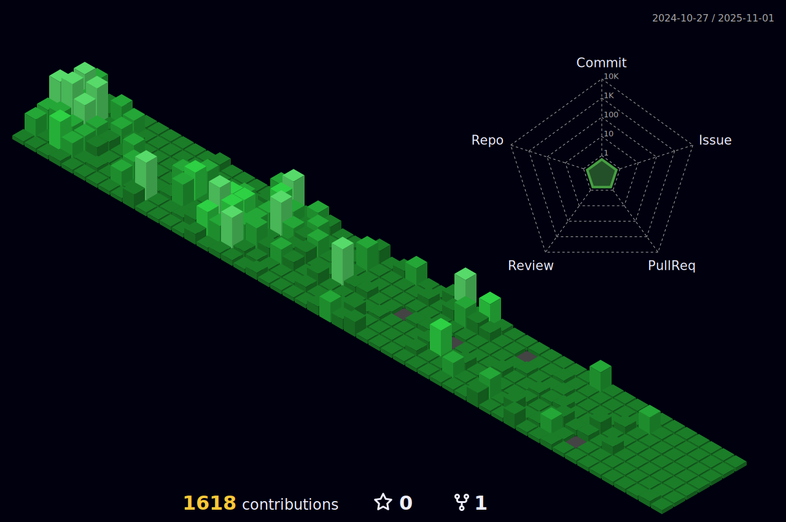

### Hi there 👋

 I am a Software Engineer with a rich background in crafting dynamic web applications. My technical expertise spans a versatile tech stack that includes React JS, Node.js, PHP, and JavaScript. Alongside these, I have honed a solid command over Python, laying a strong foundation that fuels my venture into the intricacies of data analytics.

My strengths are multifaceted, lying not only in my technical aptitude but also in my robust problem-solving and analytical skills. With a commitment to lifelong learning, I constantly immerse myself in emerging technologies, broadening my skill set and staying at the forefront of industry innovations.

<h3 align="left">Languages and Tools:</h3>

  
  
  
  
   
   
   
  
   

 <!-- 

   
  
  

 
 -->

 For a quick response, DM me on <a href="https://www.linkedin.com/in/aashishshrestha12/">LinkedIn</a>.

  <!--  -->

 <!--  -->

 <picture>
  <source media="(prefers-color-scheme: dark)" srcset="github-snake-dark.svg" />
  <source media="(prefers-color-scheme: light)" srcset="github-snake.svg" />
  
</picture>
